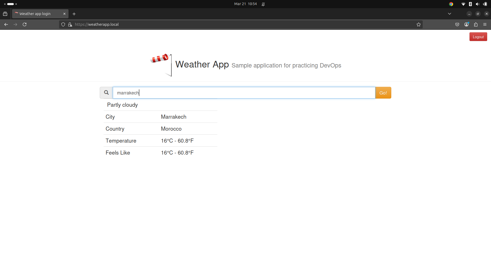

# Deploy a Weather Microservices Application on Kubernetes

## Overview

This project demonstrates how to deploy a microservices-based architecture on Kubernetes. The application consists of three main microservices: **Authentication**, **Weather**, and **UI**. The goal is to provide a scalable and resilient infrastructure capable of running multiple services in a Kubernetes cluster.



## Prerequisites

Before deploying the application, ensure the following tools are installed on your local machine:

- **Docker**: To build and manage container images.
- **Kubernetes**: To manage the cluster (this project uses a **Kind** cluster).
- **kubectl**: The Kubernetes command-line tool for interacting with the cluster.

## Project Structure

```
k8s-course-lab/
├── auth/            # Authentication service (Go + JWT)
├── k8s/             # Kubernetes configuration files and scripts
│   ├── auth/        # Kubernetes manifests for the authentication service
│   ├── mysql/       # Kubernetes manifests for MySQL database
│   ├── ui/          # Kubernetes manifests for the UI service
│   ├── weather/     # Kubernetes manifests for the weather service
│   ├── cluster.sh   # Script to build and initialize a Kind Cluster
│   └── deploy.sh    # Script to deploy the entire application on Kubernetes
├── ui/              # UI service (HTML + frontend logic)
├── weather/         # Weather service (Python)
└── README.md        # Documentation for the project
```

---

## Microservices

### 1. **Authentication Service**

- **Description:**  
  This service handles user authentication (login and registration) for the application.
  
- **Tech Stack:**  
  - Written in **Go (Golang)**.  
  - Uses **JWT (JSON Web Tokens)** for secure authentication.

- **Purpose:**  
  Provides token-based authentication to secure the communication between services.

---

### 2. **Weather Service**

- **Description:**  
  The Weather service fetches real-time weather data from a public API.

- **Tech Stack:**  
  - Written in **Python**.  
  - Consumes weather data from **RapidAPI**.

- **Purpose:**  
  It gathers and processes weather information and makes it available to the frontend UI.

---

### 3. **UI Service**

- **Description:**  
  A simple HTML-based frontend that displays weather information in a user-friendly interface.

- **Purpose:**  
  Provides a visual interface for users to view real-time weather details obtained from the Weather service.

---

## Kubernetes Directory Structure

The `k8s/` directory contains Kubernetes manifests and supporting scripts for deploying the microservices.

```
k8s/
├── auth
│   ├── deployment.yaml      # Deployment configuration for the authentication service
│   └── service.yaml         # Service definition to expose the authentication Pods
├── cluster.sh               # Script to set up and configure a Kind cluster
├── deploy.sh                # Script to deploy all services to the Kubernetes cluster
├── mysql
│   ├── headless-service.yaml # Headless service to manage MySQL cluster Pods
│   ├── init-job.yaml         # Initialization job to configure MySQL database on startup
│   ├── secret.sh             # Script to create Kubernetes secrets for database credentials
│   └── statefulset.yaml      # StatefulSet definition for MySQL to manage persistent storage
├── ui
│   ├── certificate.sh        # Script to generate TLS certificates for UI Ingress
│   ├── deployment.yaml       # Deployment configuration for the UI service
│   ├── ingress.yaml          # Ingress configuration for exposing the UI service with TLS
│   ├── service.yaml          # Service definition to expose the UI Pods
│   ├── tls.crt               # TLS certificate for secure Ingress (UI)
│   └── tls.key               # TLS private key for secure Ingress (UI)
└── weather
    ├── deployment.yaml       # Deployment configuration for the weather service
    ├── secret.sh             # Script to create secrets for weather API credentials
    └── service.yaml          # Service definition to expose the weather service
```

---

## Scripts

### 1. **cluster.sh**
This script sets up a **Kind (Kubernetes IN Docker)** cluster locally.  
It configures the Kubernetes control plane and worker nodes required for deploying the microservices.

### 2. **deploy.sh**
This script deploys all microservices (authentication, weather, UI) and related Kubernetes resources (Deployments, Services, Secrets, Ingress) to the Kubernetes cluster.

---

## How to Deploy the Application

Follow these steps to deploy the application on Kubernetes:

1. **Clone the Repository:**
   ```bash
   git clone https://github.com/your-repository/k8s-course-lab.git
   cd k8s-course-lab
   ```

2. **Set up the Kubernetes Cluster:**
   Run the following script to create and configure a Kind cluster:
   ```bash
   ./k8s/cluster.sh
   ```

3. **Deploy the Microservices:**
   Deploy all microservices to the Kubernetes cluster:
   ```bash
   ./k8s/deploy.sh
   ```

4. **Access the Application:**
   - Use `kubectl get svc` to find the external IP and port.
   - Access the UI service to view weather information.

---

## Notes on Kubernetes Configuration

- **Secrets:**  
  - Scripts like `secret.sh` in the MySQL and Weather service directories create Kubernetes secrets to securely store sensitive information (e.g., database credentials, API keys).
  
- **TLS Configuration:**  
  - The UI service is secured using TLS certificates stored in `tls.crt` and `tls.key`.
  
- **Ingress Controller:**  
  - The UI is exposed via an Ingress resource configured in `ui/ingress.yaml`. Make sure your cluster has an Ingress controller installed (e.g., NGINX Ingress).

---

## Conclusion

This project demonstrates a fully containerized microservices application deployed on Kubernetes with authentication, weather APIs, and a simple UI. It provides a foundation for building more advanced microservices architectures with secure and scalable Kubernetes deployments.